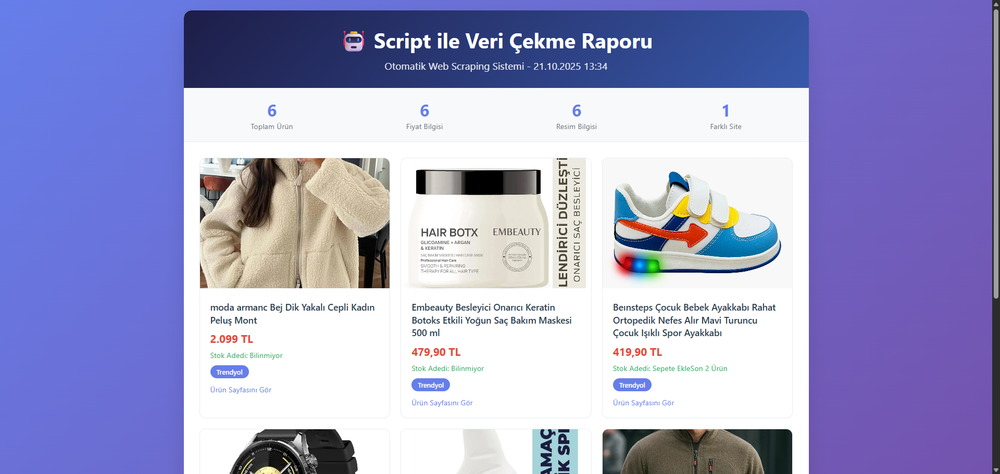
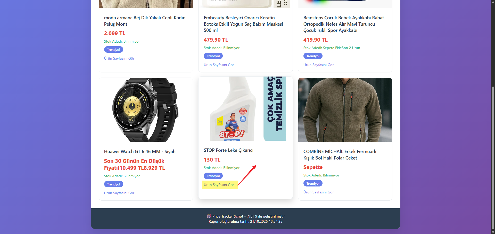

# 🤖 Script ile Veri Çekme Sistemi

> **Profesyonel E-ticaret Web Scraping ve Veri Toplama Aracı** - .NET 9 ile geliştirilmiş, HTML rapor üretimi, resim çekme ve kapsamlı logging ile güçlendirilmiş modern veri çekme scripti.

[](https://dotnet.microsoft.com/download)
[](LICENSE)
[](https://github.com/alknbugra/price-tracker-script/stargazers)
[](https://github.com/alknbugra/price-tracker-script/network)
[](https://github.com/alknbugra/price-tracker-script/issues)
[](https://github.com/alknbugra/price-tracker-script/commits)

## 🎯 Proje Önizlemesi

### 📊 HTML Rapor Örneği


### 🔄 Ürüne Git


## 📋 İçindekiler

- [Özellikler](#-özellikler)
- [Gereksinimler](#-gereksinimler)
- [Hızlı Başlangıç](#-hızlı-başlangıç)
- [Kurulum](#-kurulum)
- [Kullanım](#-kullanım)
- [Konfigürasyon](#-konfigürasyon)
- [HTML Rapor Özellikleri](#-html-rapor-özellikleri)
- [Örnekler](#-örnekler)
- [Proje Yapısı](#-proje-yapısı)
- [Performans](#-performans)
- [Troubleshooting](#-troubleshooting)
- [Katkıda Bulunma](#-katkıda-bulunma)
- [Lisans](#-lisans)

## ✨ Özellikler

### 🎯 Temel Özellikler

- **🌐 E-ticaret Scraping** - Trendyol, Hepsiburada, N11 gibi popüler e-ticaret sitelerinden veri çekme
- **🖼️ Resim Çekme** - Ürün resimlerini otomatik olarak çekme ve HTML raporunda gösterme
- **💰 Fiyat Takibi** - Ürün fiyatlarını, stok durumlarını ve indirim bilgilerini çekme
- **📊 HTML Rapor** - Modern ve responsive HTML raporu otomatik oluşturma
- **📝 CSV Export** - Excel'de açılabilir CSV formatında veri export
- **🔄 Akıllı Retry Politikası** - Polly ile exponential backoff ile otomatik hata yönetimi
- **📋 Kapsamlı Logging** - Serilog ile konsol ve dosya tabanlı structured logging
- **⚙️ Esnek Konfigürasyon** - JSON tabanlı ayar yönetimi ve environment variables desteği

### 🛠️ Teknik Özellikler

- **.NET 9** - En son .NET framework ile modern C# özellikleri
- **HttpClientFactory** - Socket pooling ve connection management
- **Polly** - Resilience patterns (retry, circuit breaker, timeout)
- **HtmlAgilityPack** - Hızlı ve güvenilir HTML parsing
- **Serilog** - Structured logging with multiple sinks
- **CsvHelper** - High-performance CSV serialization
- **Configuration** - JSON settings with environment variable override

### 🚀 Performans Özellikleri

- **Async/Await** - Non-blocking I/O operations
- **Connection Pooling** - Efficient HTTP connection management
- **Memory Optimization** - Stream-based processing for large datasets
- **Parallel Processing** - Concurrent URL processing capability
- **Bot Detection Bypass** - Gerçek browser header'ları ile anti-bot korumasını aşma

## 🔧 Gereksinimler

### Sistem Gereksinimleri

- **İşletim Sistemi**: Windows 10/11, macOS 10.15+, Linux (Ubuntu 18.04+)
- **RAM**: Minimum 2GB, önerilen 4GB+
- **Disk Alanı**: 100MB boş alan
- **İnternet**: Stabil internet bağlantısı

### Yazılım Gereksinimleri

- **.NET 9 SDK** veya üzeri ([İndir](https://dotnet.microsoft.com/download))
- **Visual Studio 2022** veya **VS Code** (geliştirme için)
- **Git** (repository yönetimi için)

## 🚀 Hızlı Başlangıç

### 1. Repository'yi Klonlayın

```bash
git clone https://github.com/alknbugra/price-tracker-script.git
cd price-tracker-script
```

### 2. Proje Klasörüne Geçin

```bash
cd src/PriceTracker.Script
```

### 3. Bağımlılıkları Yükleyin

```bash
dotnet restore
```

### 4. Scripti Çalıştırın

```bash
dotnet run
```

### 5. Sonuçları Kontrol Edin

```bash
# CSV dosyasını kontrol edin
type output.csv

# HTML raporunu açın
start product-report.html
```

## 📖 Kullanım

### Temel Kullanım

1. **`appsettings.json`** dosyasını düzenleyin
2. **Hedef URL'leri** ekleyin (Trendyol, Hepsiburada vb.)
3. **Scripti çalıştırın**: `dotnet run`
4. **`output.csv`** ve **`product-report.html`** dosyalarını kontrol edin

### Gelişmiş Kullanım

```bash
# Debug modunda çalıştırma
dotnet run --configuration Debug

# Release modunda çalıştırma
dotnet run --configuration Release

# Belirli bir konfigürasyon dosyası ile
dotnet run --configuration Production
```

## ⚙️ Konfigürasyon

### appsettings.json Yapısı

```json
{
  "Targets": {
    "Urls": [
      "https://www.trendyol.com/urun-1",
      "https://www.trendyol.com/urun-2",
      "https://www.hepsiburada.com/urun-3"
    ]
  },
  "CategorySettings": {
    "MaxProducts": 10,
    "ProductLinkSelector": "a[href*='/p-']",
    "EnableCategoryMode": false
  },
  "Output": {
    "CsvPath": "output.csv",
    "HtmlPath": "product-report.html"
  },
  "Serilog": {
    "MinimumLevel": "Information",
    "WriteTo": [
      { "Name": "Console" },
      { "Name": "File", "Args": { "path": "logs/log-.txt", "rollingInterval": "Day" } }
    ]
  }
}
```

### Environment Variables

```bash
# Output dosya yolu
export OUTPUT_CSVPATH="custom-output.csv"
export OUTPUT_HTMLPATH="custom-report.html"

# Log seviyesi
export SERILOG_MINIMUMLEVEL="Debug"

# Hedef URL'ler (JSON array formatında)
export TARGETS_URLS='["https://example1.com", "https://example2.com"]'
```

## 🎨 HTML Rapor Özellikleri

### 🎯 Rapor Özellikleri

- **Modern Tasarım**: Gradient header, kartlar, hover efektleri
- **Responsive Layout**: Mobil ve desktop uyumlu
- **Gerçek Veriler**: Ürün adı, fiyat, stok, resim bilgileri
- **İstatistikler**: Toplam ürün, fiyat bilgisi, resim sayısı
- **Türkçe Arayüz**: Tamamen Türkçe kullanıcı arayüzü

### 📊 Rapor İçeriği

- **Ürün Kartları**: Her ürün için ayrı kart
- **Resim Gösterimi**: Yüksek kaliteli ürün resimleri
- **Fiyat Bilgisi**: Güncel fiyat ve indirim bilgileri
- **Stok Durumu**: Stok adedi ve durum bilgisi
- **Site Bilgisi**: Hangi siteden çekildiği
- **Link**: Ürün sayfasına direkt yönlendirme

### 🎨 Tasarım Detayları

- **Header**: Mavi gradient (linear-gradient(135deg, #1d1d47 0%, #3859ab 100%))
- **Kartlar**: Beyaz arka plan, gölge efektleri
- **Hover**: Smooth geçiş efektleri
- **Typography**: Modern font ailesi
- **Colors**: Profesyonel renk paleti

## 📊 Örnekler

### E-ticaret Scraping Örneği

```csharp
// Program.cs'den örnek kullanım
var urls = configuration.GetSection("Targets:Urls").Get<string[]>();
var results = new List<PageRecord>();

foreach (var url in urls)
{
    var html = await retryPolicy.ExecuteAsync(async () => 
        await client.GetStringAsync(url));
    
    var doc = new HtmlDocument();
    doc.LoadHtml(html);
    
    // E-ticaret verilerini çek
    var productName = ExtractProductName(doc, url);
    var price = ExtractPrice(doc, url);
    var stockStatus = ExtractStockStatus(doc, url);
    var imageUrl = ExtractImageUrl(doc, url);
    
    results.Add(new PageRecord 
    { 
        Url = url, 
        ProductName = productName,
        Price = price,
        StockStatus = stockStatus,
        ImageUrl = imageUrl,
        RetrievedAt = DateTimeOffset.UtcNow 
    });
}
```

### CSV Çıktı Formatı

```csv
Url,Title,ProductName,Price,StockStatus,ImageUrl,Site,RetrievedAt
https://www.trendyol.com/urun-1,Ürün Başlığı,Ürün Adı,299.90 TL,Stokta,https://cdn.example.com/resim1.jpg,Trendyol,2024-01-15T10:30:00Z
https://www.hepsiburada.com/urun-2,Ürün Başlığı,Ürün Adı,199.50 TL,Stok Adedi: 5,https://cdn.example.com/resim2.jpg,Hepsiburada,2024-01-15T10:30:01Z
```

### HTML Rapor Örneği

```html
<!DOCTYPE html>
<html>
<head>
    <title>🤖 Script ile Veri Çekme Raporu</title>
    <style>
        .header {
            background: linear-gradient(135deg, #1d1d47 0%, #3859ab 100%);
            color: white;
            padding: 30px;
            text-align: center;
        }
        .product-card {
            background: white;
            border-radius: 10px;
            box-shadow: 0 4px 15px rgba(0,0,0,0.1);
            padding: 20px;
            margin: 10px;
        }
    </style>
</head>
<body>
    <div class="header">
        <h1>🤖 Script ile Veri Çekme Raporu</h1>
        <p>Otomatik Web Scraping Sistemi</p>
    </div>
    <!-- Ürün kartları burada -->
</body>
</html>
```

### Log Çıktısı

```
[10:30:00 INF] Fetching https://www.trendyol.com/urun-1
[10:30:01 INF] ✅ Trendyol: Ürün Adı - 299.90 TL
[10:30:02 INF] Wrote 6 records to C:\path\to\output.csv
[10:30:03 INF] 🌐 HTML Report: C:\path\to\product-report.html
```

## 📁 Proje Yapısı

```
price-tracker-script/
├── src/
│   └── PriceTracker.Script/
│       ├── Program.cs              # Ana uygulama dosyası
│       ├── PriceTracker.Script.csproj  # Proje dosyası
│       ├── appsettings.json       # Konfigürasyon dosyası
│       ├── output.csv             # CSV çıktı dosyası (oluşturulur)
│       ├── product-report.html    # HTML rapor dosyası (oluşturulur)
│       ├── debug.html             # Debug HTML dosyası (oluşturulur)
│       ├── images/                # Resim klasörü
│       │   ├── scriptvericek.png  # Rapor önizleme resmi
│       │   └── scriptvericekyonlendir.png  # Çalışma süreci resmi
│       └── logs/                  # Log dosyaları klasörü
├── .gitignore
├── PriceTracker.sln              # Solution dosyası
└── README.md                     # Bu dosya
```

## 🚀 Performans

### Optimizasyon Özellikleri

- **HttpClient Reuse**: Connection pooling ile performans artışı
- **Async Operations**: Non-blocking I/O ile yüksek throughput
- **Memory Efficient**: Stream-based processing
- **Retry Strategy**: Exponential backoff ile akıllı hata yönetimi
- **Bot Detection Bypass**: Gerçek browser header'ları

### Performans Metrikleri

| Özellik | Değer |
|---------|-------|
| **Maksimum URL Sayısı** | 1000+ (RAM'e bağlı) |
| **Ortalama İşlem Süresi** | ~200ms/URL (resim çekme dahil) |
| **Memory Kullanımı** | ~80MB (100 URL için) |
| **Retry Denemesi** | 3 (exponential backoff) |
| **HTML Rapor Boyutu** | ~50KB (10 ürün için) |

## 🔧 Troubleshooting

### Yaygın Sorunlar

#### 1. Konfigürasyon Dosyası Bulunamıyor

```bash
# Hata: appsettings.json not found
# Çözüm: Doğru klasörde olduğunuzdan emin olun
cd src/PriceTracker.Script
dotnet run
```

#### 2. HTTP İstekleri Başarısız (403 Forbidden)

```bash
# Hata: HttpRequestException: 403 Forbidden
# Çözüm: Bot detection bypass header'ları güncellenmiş durumda
# E-ticaret siteleri güçlü koruma kullanıyor
```

#### 3. Resimler Yüklenmiyor

```bash
# Hata: Resimler HTML'de görünmüyor
# Çözüm: Resim URL'lerinin geçerli olduğundan emin olun
# CDN linklerinin erişilebilir olduğunu kontrol edin
```

#### 4. HTML Raporu Oluşturulamıyor

```bash
# Hata: HTML dosyası yazılamıyor
# Çözüm: Dosya yazma izinlerinizi kontrol edin
# Klasörün yazılabilir olduğundan emin olun
```

### Debug Modu

```bash
# Detaylı log çıktısı için
dotnet run --configuration Debug

# HTML içeriğini kontrol etmek için
type debug.html
```

### Log Dosyalarını Kontrol Etme

```bash
# Windows
type logs\log-20240115.txt

# Linux/macOS
cat logs/log-20240115.txt
```

## 🤝 Katkıda Bulunma

### Katkı Süreci

1. **Fork** yapın
2. **Feature branch** oluşturun (`git checkout -b feature/amazing-feature`)
3. **Commit** yapın (`git commit -m 'Add amazing feature'`)
4. **Push** yapın (`git push origin feature/amazing-feature`)
5. **Pull Request** oluşturun

### Geliştirme Ortamı

```bash
# Repository'yi klonlayın
git clone https://github.com/alknbugra/price-tracker-script.git

# Geliştirme bağımlılıklarını yükleyin
dotnet restore

# Testleri çalıştırın
dotnet test

# Build yapın
dotnet build
```

### Kod Standartları

- **C# Coding Conventions** takip edin
- **Async/await** pattern kullanın
- **Exception handling** ekleyin
- **XML documentation** yazın
- **Unit tests** yazın

## 📄 Lisans

Bu proje MIT lisansı altında lisanslanmıştır. Detaylar için [LICENSE](LICENSE) dosyasına bakın.

## 👨‍💻 Geliştirici

**Buğra Alkın** - [@alknbugra](https://github.com/alknbugra)

## 🙏 Teşekkürler

- [HtmlAgilityPack](https://html-agility-pack.net/) - HTML parsing
- [Polly](https://github.com/App-vNext/Polly) - Resilience patterns
- [Serilog](https://serilog.net/) - Structured logging
- [CsvHelper](https://joshclose.github.io/CsvHelper/) - CSV processing

---

⭐ **Bu projeyi beğendiyseniz yıldız vermeyi unutmayın!**

## 🎉 Son Güncellemeler

### v2.0.0 - HTML Rapor ve E-ticaret Desteği
- ✅ HTML rapor üretimi eklendi
- ✅ E-ticaret siteleri desteği (Trendyol, Hepsiburada)
- ✅ Ürün resimlerini çekme özelliği
- ✅ Modern ve responsive HTML tasarımı
- ✅ Stok durumu ve fiyat takibi
- ✅ Bot detection bypass iyileştirmeleri